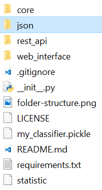

# NaïveAdvisor

A Naive-Bayes-Classifier trained with subreviews from TripAdvisor to calculate a overall rating based on given subratings.

## Install

Before using the Application dependencies have to be installed.
These can be installed with the following command over pip.

```
$ pip install -r requirements.txt
```

## Usage

The Server can be started running the `__init__.py` file.

```
$ python __init__.py
```

The web interface can be accessed over the ``index.html`` file in the ``web_interface`` folder.

## Force Training

The training data can be pulled from ``http://times.cs.uiuc.edu/~wang296/Data/``, have to be in json format and need to be in a ``json`` directory in the project root.



Now you can start the program with forced training by using the `--ft` flag like this:

```
$ python __init__.py --ft
```

## License

[MIT License](LICENSE)
